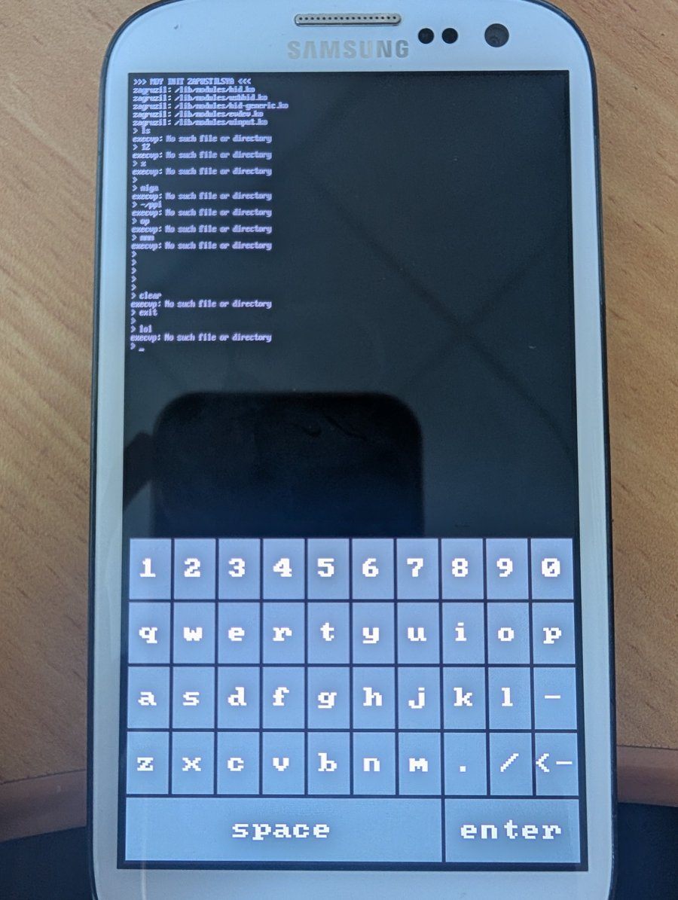
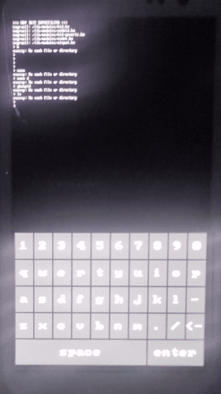
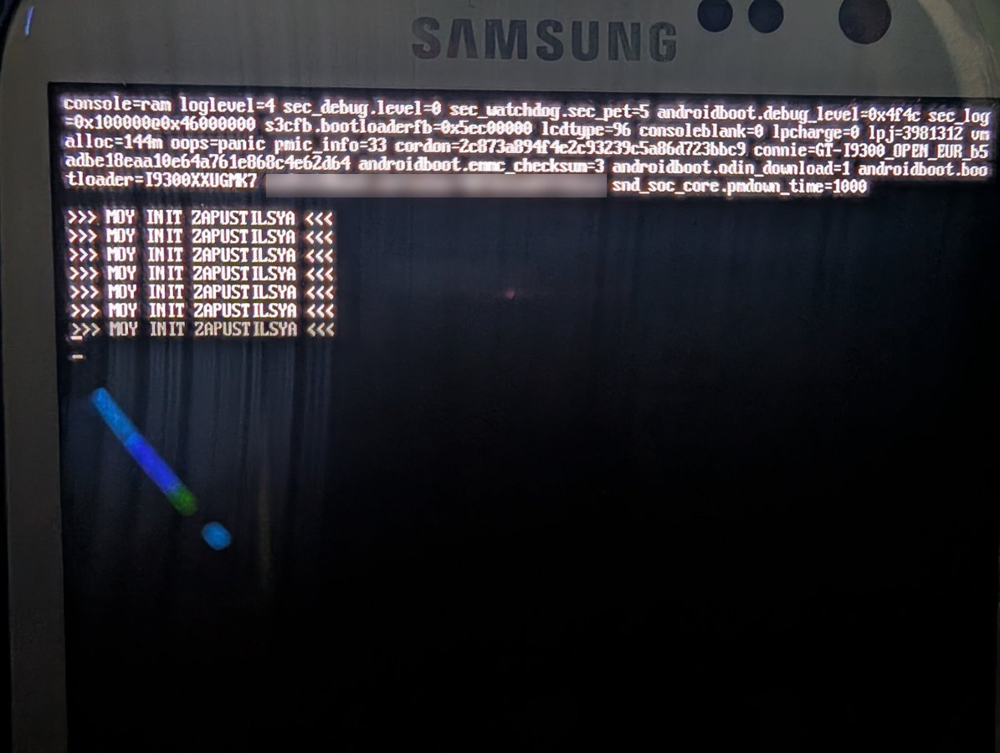

# Minus

**My own tiny operating system for the Samsung Galaxy S3 (GT-I9300) — built on the Linux kernel, everything else written from scratch while learning C.**

The name says it all: take a phone OS and *subtract* everything you don't need. No Android, no Google, no Java, no 2 GB of stuff running in the background. Just a kernel, my own init, my own shell and (as of today) my own on-screen keyboard.

<p align="center">
  
  &nbsp;&nbsp;
  
</p>

> ⚠️ **Status: very early. It boots, it takes input, it does basically nothing useful yet.**
> The shell only knows `cd` and `exit` — every other command answers `execvp: No such file or directory` because there are no programs in `/bin` yet. That's the next step.

---

## What works right now

- ✅ Boots on a real Galaxy S3 (not just QEMU)
- ✅ My own `init` runs as **PID 1**, mounts `/dev`, `/proc`, `/sys`
- ✅ Loads kernel modules **from my own C code** (no `modprobe`, no busybox)
- ✅ My own shell `moysh` starts on the screen with a proper controlling terminal
- ✅ **On-screen keyboard**: drawn directly into the framebuffer, reads the touchscreen, types into the shell
- ❌ No commands yet (`ls`, `cat`, … are coming)
- ❌ No Wi-Fi, no GUI, no apps
- ❌ Calls / SMS / mobile data — the modem doesn't work on mainline Linux at all, so this phone is basically a small Wi-Fi tablet

## Hardware

| | |
|---|---|
| Phone | Samsung Galaxy S3 International, **GT-I9300** (codename `m0`) |
| SoC | Exynos 4412, 4× Cortex-A9 (ARMv7) |
| RAM | 1 GB |
| Touchscreen | MELFAS MMS114 (driver built into the kernel) |
| Boot partition | `/dev/block/mmcblk0p5`, **only 8 MB** |

Before this I tried an LG P500 (dead) and an LG E430 (wouldn't turn on). Third phone's the charm.

---

## How it boots

```
Samsung bootloader
   └─ Linux kernel 6.18.9 (borrowed from postmarketOS)
        └─ my ramdisk
             └─ /init  ← moy_init (PID 1, my code)
                  ├─ mount devtmpfs / proc / sysfs
                  ├─ wait for /dev/fb0 (the screen)
                  ├─ load modules: hid, usbhid, hid-generic, evdev, uinput
                  ├─ start /bin/moy_kbd in the background  (on-screen keyboard)
                  └─ loop: fork → setsid → /bin/moysh      (my shell, restarted if it exits)
```

Everything under "my ramdisk" is mine. The kernel is not — see below why.

---

## The story (a.k.a. things that went wrong)

This is the interesting part. Each of these cost me hours, so maybe it saves you some.

### 1. My own kernel didn't fit
I built a kernel with Buildroot. It was **8.6 MB**, the boot partition is **8 MB**. Switching compression from gzip to XZ in `menuconfig` did nothing — Buildroot kept overwriting it. What worked was editing the kernel's `.config` directly:

```bash
sed -i 's/CONFIG_KERNEL_GZIP=y/# CONFIG_KERNEL_GZIP is not set/' output/build/linux-*/.config
sed -i 's/# CONFIG_KERNEL_XZ is not set/CONFIG_KERNEL_XZ=y/' output/build/linux-*/.config
make linux-rebuild
```

8.6 MB → **5.9 MB**. It fit.

### 2. …and then it hung on the Samsung logo forever
Even with the device tree appended correctly (`cat zImage dtb > zImage-dtb`, verified the `d00dfeed` magic with `xxd`), my kernel never got past the logo.

**Solution: a hybrid.** I took the kernel out of the official postmarketOS boot image for `samsung-m0` (which I had already confirmed boots on this phone) and put **my own ramdisk** next to it. That booted. Writing a kernel config for this phone from scratch is a project for another day.

### 3. The invisible init
The hybrid booted… to a black screen. I thought my init was crashing. It wasn't — I proved it by making init call `reboot()` as a signal, and the phone rebooted. So init was running, just **invisible**.

Then I printed `/proc/cmdline` to the screen and found the reason:

<p align="center"></p>

The Samsung bootloader **throws away the kernel command line from the boot image and replaces it with its own.** And its own starts with `console=ram` — the console goes into RAM, not to the screen. So `/dev/console` was a black hole.

**Fix: never write to `/dev/console` on this phone. Open `/dev/tty1` and write there.**

(Side note: the same line contains `lpcharge=0`. It becomes `1` when the phone is charging while powered off — useful later for a charging screen.)

### 4. Waiting for the screen
The framebuffer driver needs a moment to appear. I peeked at how postmarketOS does it in their initramfs (their `setup_framebuffer` just waits for `/dev/fb0` up to 10 seconds) and did the same in C: `access("/dev/fb0")` in a loop with `usleep(100000)`.

### 5. Loading kernel modules without any tools
There's no `modprobe` in my system. Turns out you don't need it — it's one syscall:

```c
int fd = open(path, O_RDONLY);
syscall(SYS_finit_module, fd, "", 0);
```

The modules themselves came from the full postmarketOS image, which was an **Android sparse image** and wouldn't mount directly:

```bash
simg2img pmos-full.img pmos-raw.img          # sparse → normal disk image
sudo losetup -fP --show pmos-raw.img         # → /dev/loop0 with partitions
sudo mount -o ro /dev/loop0p2 /mnt/pmos-root
zstd -d /mnt/pmos-root/lib/modules/6.18.9-postmarketos-exynos4/kernel/drivers/.../something.ko.zst -o something.ko
```

Important: modules only work with the **exact same kernel build** they were made for — that's another reason to use pmOS's kernel.

### 6. USB keyboard via OTG — defeated by a fake cable
The plan was to plug in a USB keyboard. No power on the OTG port. Not in my system, not even in TWRP. A few hours with a multimeter later:

An OTG adapter is special in exactly one way — inside the micro-USB plug, pin 4 (**ID**) is shorted to pin 5 (**GND**). That's how the phone knows "I'm the host now, turn on the 5 V". My adapter had **no connection between ID and GND.** It was a regular cable with "OTG" printed on the bag.

So instead of buying a new cable I made…

### 7. …an on-screen keyboard
`moy_kbd` is ~220 lines of C, no libraries:

- **Draws** the keys straight into `/dev/fb0` (mmap the framebuffer, write pixels)
- **Reads the finger** from `/dev/input/event1` (the MELFAS touchscreen)
- **Types** by creating a fake keyboard through `/dev/uinput`. The kernel can't tell it apart from a real USB keyboard, so the letters go into `tty1` → into my shell. The shell didn't need a single change.
- Shrinks the text console to the top 3/5 of the screen so text doesn't run over the keys
- Font: [font8x8](https://github.com/dhepper/font8x8) by Daniel Hepper (public domain), scaled ×4

How I found which input device is the touchscreen: printed `/proc/bus/input/devices` on the phone. It was **MELFAS MMS114** on `event1` — not the Atmel chip I had assumed.

---

## Files

| File | What it is |
|---|---|
| `moy_init.c` | The init (PID 1). Mounts, loads modules, starts keyboard and shell |
| `moy_shell.c` | The shell (`moysh`). Builtins: `cd`, `exit`. Everything else → `fork` + `execvp` |
| `moy_kbd.c` | On-screen keyboard |
| `font8x8_basic.h` | The 8×8 font (download it, see below) |
| `bootimg.cfg` | Settings for `abootimg` (addresses for the S3) |
| `moy_cat.c`, `moy_wc.c`, `moy_grep.c` | My versions of classic tools from learning C — not in the image yet |

---

## Want to try it?

**Honestly: there's nothing to *do* in it yet.** But if you have a GT-I9300 and you're curious how this works, you can build the same thing. It's more of a "swap my files into your setup" situation than a polished installer.

> ⚠️ **You can brick your boot partition. Make a backup first (step 0). I'm not responsible for your phone.**

### What you need
- Galaxy S3 **GT-I9300** with **TWRP** recovery installed
- A Linux machine (I use WSL on Windows)
- `adb`, `abootimg`, `cpio`, `gzip`, `zstd`, `simg2img` (`android-sdk-libsparse-utils`)
- An ARM cross-compiler — I use the one from [Buildroot](https://buildroot.org/) (`arm-buildroot-linux-gnueabi-gcc`), any ARMv7 static-capable GCC should do
- The postmarketOS images for **samsung-m0** from [images.postmarketos.org](https://images.postmarketos.org/) — both the `-boot.img` and the full `.img.xz`

### 0. Back up your boot partition
Boot into TWRP (Volume Up + Home + Power), then:
```bash
adb shell dd if=/dev/block/mmcblk0p5 of=/tmp/boot_backup.img
adb pull /tmp/boot_backup.img
```
To restore later: push it back and `dd` it the other way around.

### 1. Take the kernel from the pmOS boot image
```bash
mkdir pmos-raspil && cd pmos-raspil
abootimg -x ../*-samsung-m0-boot.img      # gives zImage, initrd.img, bootimg.cfg
```
Use this `bootimg.cfg` as a base, but **delete the `bootsize` line** (otherwise abootimg complains about size). The important addresses for the S3:
```
pagesize = 0x800
kerneladdr = 0x10008000
ramdiskaddr = 0x11000000
secondaddr = 0x10f00000
tagsaddr = 0x10000100
```
The `cmdline` doesn't matter — the bootloader replaces it anyway (see story #3).

### 2. Get the modules
Mount the full pmOS image as shown in story #5 and unpack these into `ramdisk/lib/modules/`:
`hid.ko`, `usbhid.ko`, `hid-generic.ko`, `evdev.ko` (all under `drivers/hid/` and `drivers/input/`) and `uinput.ko` (`drivers/input/misc/`).

### 3. Build
```bash
curl -sL https://raw.githubusercontent.com/dhepper/font8x8/master/font8x8_basic.h -o font8x8_basic.h

CC=arm-buildroot-linux-gnueabi-gcc   # or your ARM compiler
$CC -static moy_init.c  -o init
$CC -static moy_shell.c -o moysh
$CC -static moy_kbd.c   -o moy_kbd
```
`-static` is required — there are no shared libraries in the ramdisk.

### 4. Assemble the ramdisk
```
ramdisk/
├── init                  ← moy_init
├── bin/
│   ├── moysh
│   └── moy_kbd
├── lib/modules/*.ko
├── dev/  proc/  sys/     ← empty folders, init mounts things here
```
```bash
cd ramdisk && find . | cpio -o -H newc | gzip > ../ramdisk.gz && cd ..
abootimg --create minus.img -f bootimg.cfg -k pmos-raspil/zImage -r ramdisk.gz
```

### 5. Flash (from TWRP)
```bash
adb push minus.img /tmp/minus.img
adb shell dd if=/tmp/minus.img of=/dev/block/mmcblk0p5
adb reboot
```
You should see the init messages, a `>` prompt and grey keys at the bottom. Type `cd /proc` and enjoy the fact that nothing else works. 🙂

---

## Known issues
- The keyboard **flickers** — it redraws itself every 0.7 s in case the console scribbled over it. Needs a smarter approach.
- Lowercase only, no Shift, no Cyrillic.
- Small keys + big finger = typos (`gbcopld` was supposed to be something else).
- No commands in `/bin` yet.

## Roadmap
1. Basic commands: my own `ls`, then port `moy_cat` / `moy_wc` / `moy_grep`
2. Graphics from scratch: pixel → rectangle → double buffering → animation
3. A real UI with [LVGL](https://lvgl.io/) (lightweight, works straight on the framebuffer)
4. Wi-Fi (`brcmfmac` driver exists)
5. Signed updates from GitHub
6. My own package format **MPK** (*Minus Package*) and a small app store
7. Own boot splash and charging screen, lock screen with PIN, brightness, battery icons…
8. Some day: an actual kernel config for this phone

---

## Credits
- **[postmarketOS](https://postmarketos.org/)** — the kernel, the modules, and a lot of ideas from reading their initramfs scripts. This project would've died at story #2 without them.
- **[Buildroot](https://buildroot.org/)** — cross-compiler toolchain
- **[font8x8](https://github.com/dhepper/font8x8)** by Daniel Hepper — public domain font
- **TWRP**, **abootimg**
- `moy_kbd.c` was written with AI help (Claude). The rest I wrote myself while learning C — with a lot of explanations along the way.

## License
My code is licensed under **[GPL-3.0](LICENSE)**. You can use it, change it and share it — but keep my name on it, and anything you build from it has to stay open source too.

Not mine, not covered by this license: the font (public domain, Daniel Hepper) and the kernel and modules from postmarketOS (GPL-2.0, their authors).

---

*By [valera1w21](https://github.com/valera1w21) — learning C by building an OS for a phone from 2012. Donations welcome, but mostly: stars and curiosity.*
