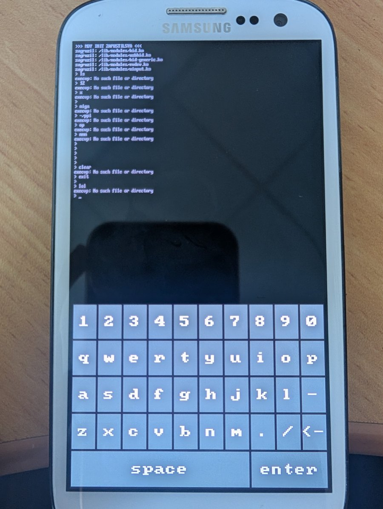
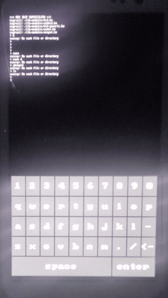
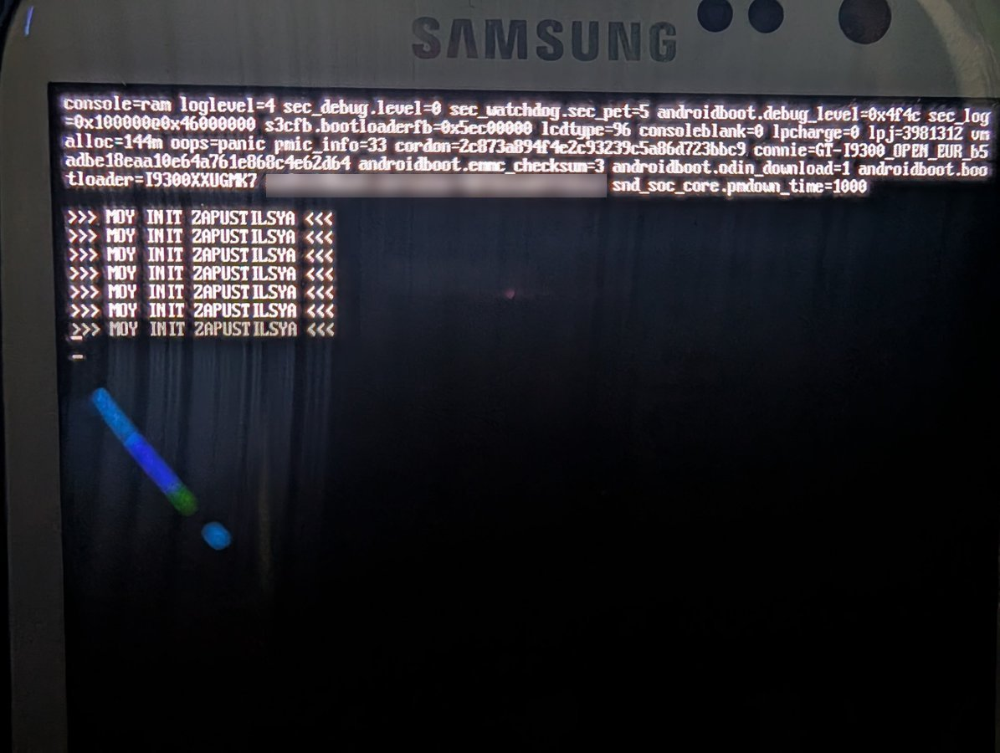

# Minus

**My own tiny operating system for the Samsung Galaxy S3 (GT-I9300) — built on the Linux kernel, everything else written from scratch while learning C.**

The name says it all: take a phone OS and *subtract* everything you don't need. No Android, no Google, no Java, no 2 GB of stuff running in the background. Just a kernel, my own init, my own shell and my own on-screen keyboard — using **43 MB of RAM** in total.

<p align="center">
  
  &nbsp;&nbsp;
  
</p>

> ⚠️ **Status: early.** It boots on a real phone, takes input from the touchscreen and runs real commands. There is no graphical desktop yet — it's designed (Windows XP–inspired, see the roadmap), the code is next.

---

## What works right now

- ✅ Boots on a real Galaxy S3 (not just QEMU)
- ✅ My own `init` runs as **PID 1**, mounts `/dev`, `/proc`, `/sys`
- ✅ Loads kernel modules **from my own C code** — one syscall, no `modprobe`
- ✅ My own shell `msh` with a proper controlling terminal
- ✅ **On-screen keyboard** `mkbd`: drawn into the framebuffer, reads the touchscreen, types into the shell
- ✅ Real commands: `ls`, `cat`, `dmesg`, `top`, `free`, `mount`, `vi`… from a static **BusyBox**
- ✅ First own graphics: `fbgradient` paints the whole screen pixel by pixel
- ❌ No desktop / GUI yet
- ❌ No Wi-Fi yet (driver exists, not set up)
- ❌ Calls / SMS / mobile data — the modem doesn't work on mainline Linux, so this phone is basically a small Wi-Fi tablet

## Hardware

| | |
|---|---|
| Phone | Samsung Galaxy S3 International, **GT-I9300** (codename `m0`) |
| SoC | Exynos 4412, 4× Cortex-A9 (ARMv7, 32-bit) |
| RAM | 1 GB |
| Screen | 720×1280, 32 bits per pixel |
| Touchscreen | MELFAS MMS114 (driver built into the kernel), `/dev/input/event1` |
| Boot partition | `/dev/block/mmcblk0p5`, **only 8 MB** |

Before this I tried an LG P500 (dead) and an LG E430 (wouldn't turn on). Third phone's the charm.

---

## How it boots

```
Samsung bootloader
   └─ Linux kernel 6.18.9 (borrowed from postmarketOS)
        └─ my ramdisk
             └─ /init  ← src/init/init.c (PID 1, my code)
                  ├─ mount devtmpfs / proc / sysfs
                  ├─ wait for /dev/fb0 (the screen)
                  ├─ load modules: hid, usbhid, hid-generic, evdev, uinput
                  ├─ start /bin/mkbd in the background   (on-screen keyboard)
                  └─ loop: fork → setsid → /bin/msh      (my shell, restarted if it exits)
```

Everything under "my ramdisk" is mine, except BusyBox. The kernel is not mine — see below why.

---

## Project structure

```
Mr-Minus-os/
├── src/
│   ├── init/        init.c            the init (PID 1)
│   ├── shell/       msh.c             the shell
│   ├── kbd/         kbd.c + font      the on-screen keyboard
│   ├── ui/                            the future desktop
│   └── tools/                         small programs from learning C
├── device/
│   └── samsung-m0/  bootimg.cfg       everything specific to the Galaxy S3
├── assets/                            icons, wallpapers, fonts (coming)
├── scripts/                           build and flash scripts (coming)
└── docs/                              pictures for this README
```

Code shared by all phones lives in `src/`. Everything that belongs to one phone model lives in `device/<codename>/` — so a Galaxy S5 would one day get its own `device/samsung-klte/` next to it.

| File | What it is |
|---|---|
| `src/init/init.c` | The init (PID 1). Mounts, loads modules, starts keyboard and shell |
| `src/shell/msh.c` | The shell (`msh`). Builtins: `cd`, `exit`. Everything else → `fork` + `execvp` |
| `src/kbd/kbd.c` | On-screen keyboard (`mkbd`) |
| `src/kbd/font8x8_basic.h` | The 8×8 font (public domain, Daniel Hepper) |
| `src/tools/cat.c`, `wc.c`, `grep.c` | My versions of classic tools |
| `src/tools/fork_demo.c` | Learning example: how `fork` creates a child process |
| `src/tools/fbgradient.c` | Paints a color gradient straight into the framebuffer |
| `device/samsung-m0/bootimg.cfg` | Settings for `abootimg` (addresses for the S3) |

---

## The story (a.k.a. things that went wrong)

This is the interesting part. Each of these cost me hours, so maybe it saves you some.

### 1. My own kernel didn't fit

I built a kernel with Buildroot. It was **8.6 MB**, the boot partition is **8 MB**. Switching compression from gzip to XZ in `menuconfig` did nothing — Buildroot kept overwriting it. What worked was editing the kernel's `.config` directly:

```bash
sed -i 's/CONFIG_KERNEL_GZIP=y/# CONFIG_KERNEL_GZIP is not set/' output/build/linux-*/.config
sed -i 's/# CONFIG_KERNEL_XZ is not set/CONFIG_KERNEL_XZ=y/' output/build/linux-*/.config
make linux-rebuild
```

8.6 MB → **5.9 MB**. It fit.

### 2. …and then it hung on the Samsung logo forever

Even with the device tree appended correctly (`cat zImage dtb > zImage-dtb`, verified the `d00dfeed` magic with `xxd`), my kernel never got past the logo.

**Solution: a hybrid.** I took the kernel out of the official postmarketOS boot image for `samsung-m0` (which I had already confirmed boots on this phone) and put **my own ramdisk** next to it. That booted. Writing a kernel config for this phone from scratch is a project for another day.

### 3. The invisible init

The hybrid booted… to a black screen. I thought my init was crashing. It wasn't — I proved it by making init call `reboot()` as a signal, and the phone rebooted. So init was running, just **invisible**.

Then I printed `/proc/cmdline` to the screen and found the reason:

<p align="center"></p>

The Samsung bootloader **throws away the kernel command line from the boot image and replaces it with its own.** And its own starts with `console=ram` — the console goes into RAM, not to the screen. So `/dev/console` was a black hole.

**Fix: never write to `/dev/console` on this phone. Open `/dev/tty1` and write there.**

(Side note: the same line contains `lpcharge=0`. It becomes `1` when the phone is charging while powered off — useful later for a charging screen.)

### 4. Waiting for the screen

The framebuffer driver needs a moment to appear. I peeked at how postmarketOS does it in their initramfs (their `setup_framebuffer` just waits for `/dev/fb0` up to 10 seconds) and did the same in C: `access("/dev/fb0")` in a loop with `usleep(100000)`.

### 5. Loading kernel modules without any tools

There's no `modprobe` in my system. Turns out you don't need it — it's one syscall:

```c
int fd = open(path, O_RDONLY);
syscall(SYS_finit_module, fd, "", 0);
```

The modules themselves came from the full postmarketOS image, which was an **Android sparse image** and wouldn't mount directly:

```bash
simg2img pmos-full.img pmos-raw.img          # sparse → normal disk image
sudo losetup -fP --show pmos-raw.img         # → /dev/loop0 with partitions
sudo mount -o ro /dev/loop0p2 /mnt/pmos-root
zstd -d /mnt/pmos-root/lib/modules/6.18.9-postmarketos-exynos4/kernel/drivers/.../something.ko.zst -o something.ko
```

Important: modules only work with the **exact same kernel build** they were made for — another reason to use pmOS's kernel.

### 6. USB keyboard via OTG — defeated by a fake cable

The plan was to plug in a USB keyboard. No power on the OTG port. Not in my system, not even in TWRP. A few hours with a multimeter later:

An OTG adapter is special in exactly one way — inside the micro-USB plug, pin 4 (**ID**) is shorted to pin 5 (**GND**). That's how the phone knows "I'm the host now, turn on the 5 V". My adapter had **no connection between ID and GND.** It was a regular cable with "OTG" printed on the bag.

Later I checked what the phone itself sees on the port — the charger chip reports it in `/sys/class/extcon/extcon0/state`. Plugged into a PC it says `USB=1` and `SDP=1` (*Standard Downstream Port* — a normal PC port, data plus slow charging). A real OTG adapter would light up a `HOST` line instead.

So instead of buying a new cable I made…

### 7. …an on-screen keyboard

`mkbd` is ~220 lines of C, no libraries:

- **Draws** the keys straight into `/dev/fb0` (mmap the framebuffer, write pixels)
- **Reads the finger** from `/dev/input/event1` (the MELFAS touchscreen)
- **Types** by creating a fake keyboard through `/dev/uinput`. The kernel can't tell it apart from a real USB keyboard, so the letters go into `tty1` → into my shell. The shell didn't need a single change.
- Shrinks the text console to the top 3/5 of the screen so text doesn't run over the keys
- Font: [font8x8](https://github.com/dhepper/font8x8) by Daniel Hepper (public domain), scaled ×4

How I found which input device is the touchscreen: printed `/proc/bus/input/devices` on the phone. It was **MELFAS MMS114** on `event1` — not the Atmel chip I had assumed.

### 8. Real commands: BusyBox

With a keyboard, the shell could finally take commands — but `/bin` was empty. I decided to write my own things where I want to learn (init, shell, graphics) and use ready tools for the rest. **BusyBox** is one program that contains hundreds of commands.

The one from Buildroot was **dynamically linked** — it needed libraries my ramdisk doesn't have. Rebuilt it static, then stripped the debug info (2.2 MB → 1.8 MB, every byte counts in an 8 MB partition):

```bash
sed -i 's/# CONFIG_STATIC is not set/CONFIG_STATIC=y/' output/build/busybox-*/.config
make busybox-rebuild
arm-buildroot-linux-gnueabi-strip output/target/bin/busybox
```

Then symlinks: `ls → busybox`, `cat → busybox` and so on. BusyBox looks at the name it was started with and behaves like that command. I deliberately did **not** link `sh` and `init` — those are mine.

### 9. First pixels

`fbgradient` asks the kernel about the screen with `ioctl(FBIOGET_VSCREENINFO)` / `FBIOGET_FSCREENINFO`, maps it into memory with `mmap` and writes every pixel. What the S3 reported:

- **720×1280**, 32 bits per pixel (4 bytes)
- one line = **2880 bytes** — exactly 720 × 4, no padding
- all screen memory = **3,686,400 bytes** — exactly *one* screen, no second page

The last one matters: there is no hardware double buffering. To draw without flicker, the desktop will draw into its own buffer in RAM and copy the finished frame to the screen.

---

## Want to try it?

**Honestly: there's not much to *do* in it yet.** But if you have a GT-I9300 and you're curious how this works, you can build the same thing.

> ⚠️ **You can brick your boot partition. Make a backup first (step 0). I'm not responsible for your phone.**

### What you need

- Galaxy S3 **GT-I9300** with **TWRP** recovery installed
- A Linux machine (I use WSL on Windows)
- `adb`, `abootimg`, `cpio`, `gzip`, `zstd`, `simg2img` (`android-sdk-libsparse-utils`)
- An ARM cross-compiler — I use the one from [Buildroot](https://buildroot.org/) (`arm-buildroot-linux-gnueabi-gcc`); any ARMv7 static-capable GCC should do
- A **static** BusyBox for ARM (see story #8)
- The postmarketOS images for **samsung-m0** from [images.postmarketos.org](https://images.postmarketos.org/) — both the `-boot.img` and the full `.img.xz`

### 0. Back up your boot partition

Boot into TWRP (Volume Up + Home + Power), then:

```bash
adb shell dd if=/dev/block/mmcblk0p5 of=/tmp/boot_backup.img
adb pull /tmp/boot_backup.img
```

To restore later: push it back and `dd` it the other way around.

### 1. Take the kernel from the pmOS boot image

```bash
mkdir pmos-boot && cd pmos-boot
abootimg -x ../*-samsung-m0-boot.img      # gives zImage, initrd.img, bootimg.cfg
```

You can use `device/samsung-m0/bootimg.cfg` from this repo. If you make your own from the pmOS one, **delete the `bootsize` line** (otherwise abootimg complains about the size). The `cmdline` doesn't matter — the bootloader replaces it anyway (story #3).

### 2. Get the modules

Mount the full pmOS image as shown in story #5 and unpack these into `ramdisk/lib/modules/`: `hid.ko`, `usbhid.ko`, `hid-generic.ko`, `evdev.ko` (under `drivers/hid/` and `drivers/input/`) and `uinput.ko` (`drivers/input/misc/`).

### 3. Build

```bash
CC=arm-buildroot-linux-gnueabi-gcc   # or your ARM compiler
mkdir -p build
$CC -static src/init/init.c  -o build/init
$CC -static src/shell/msh.c  -o build/msh
$CC -static src/kbd/kbd.c    -o build/mkbd
```

`-static` is required — there are no shared libraries in the ramdisk.

### 4. Assemble the ramdisk

```
ramdisk/
├── init                  ← build/init
├── bin/
│   ├── msh               ← build/msh
│   ├── mkbd              ← build/mkbd
│   ├── busybox           ← static + stripped
│   └── ls, cat, dmesg, free, top, … → symlinks to busybox
├── lib/modules/*.ko
└── dev/  proc/  sys/     ← empty folders, init mounts things here
```

```bash
cd ramdisk/bin
for c in ls cat dmesg mount ps top free df uname echo mkdir rm cp mv grep vi clear uptime reboot poweroff; do ln -sf busybox $c; done
cd ../..

cd ramdisk && find . | cpio -o -H newc | gzip > ../ramdisk.gz && cd ..
abootimg --create minus.img -f device/samsung-m0/bootimg.cfg -k pmos-boot/zImage -r ramdisk.gz
ls -l minus.img      # must be smaller than 8388608 bytes
```

### 5. Flash (from TWRP)

```bash
adb push minus.img /tmp/minus.img
adb shell dd if=/tmp/minus.img of=/dev/block/mmcblk0p5
adb reboot
```

You should see the init messages, a `>` prompt and grey keys at the bottom. Try `ls /`, `free`, `uname -a`, `dmesg`.

---

## Known issues

- The keyboard **flickers** and uses ~2% CPU — it redraws itself every 0.7 s in case the console scribbled over it. The desktop will fix this by owning the whole screen.
- Lowercase only: no Shift, no Ctrl (so no Ctrl+C), no `_`, `|` or `*`.
- `reboot` alone does nothing — my init doesn't handle the request yet. Use **`reboot -f`**.
- `cat` on a binary file fills the terminal with garbage. `reset` fixes it.
- The whole system lives in the ramdisk, which lives in RAM: **nothing you write survives a reboot**.
- The boot image is ~7.2 MB of the 8 MB limit. The desktop will have to live on the SD card or internal storage.

## Roadmap

1. **Desktop** — Windows XP–inspired, designed and ready to build: taskbar with a green *minus* start button, windows with blue title bars, lock screen with PIN, quick settings, boot splash. All art drawn from scratch, no Microsoft assets.
2. **Own small graphics library** — back buffer, rectangles, text, images, touch → buttons.
3. **Take over the screen** (`KD_GRAPHICS`), and fall back to the text console + keyboard if the desktop crashes.
4. **Screen sleep** after a timeout, wake on touch or power button. Battery and charging status in the taskbar.
5. **Move the system out of the ramdisk** onto the SD card / internal storage.
6. **Wi-Fi** (`brcmfmac` driver exists).
7. My own package format **MPK** (*Minus Package*) and signed updates from GitHub.
8. **More phones** — the `device/` folder is already prepared for it.

---

## Credits

- **[postmarketOS](https://postmarketos.org/)** — the kernel, the modules, and a lot of ideas from reading their initramfs scripts. This project would've died at story #2 without them.
- **[Buildroot](https://buildroot.org/)** — cross-compiler toolchain
- **[BusyBox](https://busybox.net/)** — all the command-line tools
- **[font8x8](https://github.com/dhepper/font8x8)** by Daniel Hepper — public domain font
- **TWRP**, **abootimg**
- `src/kbd/kbd.c` was written with AI help (Claude). The rest I wrote myself while learning C — with a lot of explanations along the way.

## License

My code is licensed under **[GPL-3.0](LICENSE)**. You can use it, change it and share it — but keep my name on it, and anything you build from it has to stay open source too.

Not mine, not covered by this license: the font (public domain, Daniel Hepper), the kernel and modules from postmarketOS (GPL-2.0, their authors) and BusyBox (GPL-2.0, its authors).

---

*By [valera1w21](https://github.com/valera1w21) — learning C by building an OS for a phone from 2012. Donations welcome, but mostly: stars and curiosity.*